ART diagrams
============

This page provides process flow-charts for generalized ART algorithms. These algorithms/
are not specific to any particular variant (e.g., Fuzzy, Gaussian, etc.) and provide a /
high-level overview of how the algorithms work.

This page is not yet comprehensive of all algorithms but will continue to grow.

.. contents::
   :local:
   :depth: 1

ART Process Flow
----------------

   Generalized ART process flow from raw data to weight updates.

SimpleARTMAP Process Flow
-------------------------

   Generalized Simple ARTMAP process flow from raw data to weight updates. SimpleARTMAP/
primarily functions by introducing a second "check" to the vigilance phase of the /
standard ART algorithm. This second vigilance enforces a 1-to-many mapping from cluster/
to class label and thus learns a functional mapping. If this second check fails, the /
first vigilance check is adapted according to the match-tracking function /
(which may either relax or restrict the vigilance check).

ARTMAP Process Flow
-------------------

   A generalized, standard ARTMAP process flow from raw data to weight updates. /
Standard ARTMAP differs from SimpleARTMAP in that it allows the y-side data to be /
real-valued vectors rather than just labels. ARTMAP effectively functions by allowing /
the y-side data to be clustered in an unsupervised fashion and then feeding the /
resulting cluster labels along with the x-side data to SimpleARTMAP.
