class diagrams
==============

This page provides a family-tree of sorts which visualizes the inheritance among
related artlib classes. Only classes sharing a relationship to other artlib classes
are documented on this page.

.. contents::
   :local:
   :depth: 1

BaseART Inheritance
-------------------

   Inheritance flow among BaseART variants. All children of the BaseART class are
interchangeable in the compound ART architectures implemented in artlib.

BaseARTMAP Inheritance
----------------------

.. figure:: ../diagrams/system-diagram-base-artmap.svg
   :name: fig-base-artmap-class-diagram
   :alt: BaseARTMAP class diagram
   :align: center
   :width: 100%

   Inheritance flow among BaseARTMAP variants. All children of the BaseART class
are compatible with these architectures. For clarity, the c++ optimized ARTMAP
variants were omitted from this diagram -- all of which are children of SimpleARTMAP.

DeepARTMAP Inheritance
----------------------

.. figure:: ../diagrams/system-diagram-deep-artmap.svg
   :name: fig-deep-artmap-class-diagram
   :alt: DeepARTMAP class diagram
   :align: center
   :width: 100%

   Inheritance flow among DeepARTMAP variants. All children of the BaseART class
are compatible with these architectures.