class diagrams
========

.. contents::
   :local:
   :depth: 1

ART Process Flow
---------------

   ART process flow from raw data to weight updates.

SimpleARTMAP Process Flow
----------------

.. figure:: ../diagrams/simple-artmap-diagram.svg
   :name: simple-artmap-diagram
   :alt: Simple ARTMAP process flowchart
   :align: center
   :width: 100%

   Simple ARTMAP process flow from raw data to weight updates.

ARTMAP Process Flow
----------------

   ARTMAP process flow from raw data to weight updates.

BaseART Inheritance
------------

.. figure:: ../diagrams/system-diagram-base-art.svg
   :name: fig-base-art-class-diagram
   :alt: BaseART class diagram
   :align: center
   :width: 100%

   Inheritance flow among BaseART variants.

BaseARTMAP Inheritance
------------

   Inheritance flow among BaseARTMAP variants.

DeepARTMAP Inheritance
------------

.. figure:: ../diagrams/system-diagram-deep-artmap.svg
   :name: fig-deep-artmap-class-diagram
   :alt: DeepARTMAP class diagram
   :align: center
   :width: 100%

   Inheritance flow among DeepARTMAP variants.